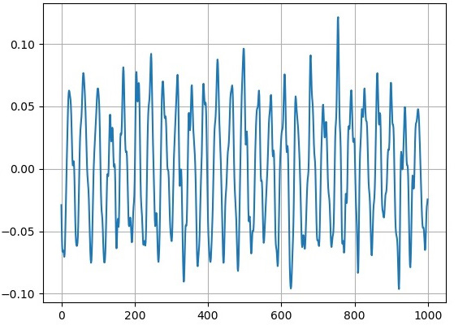
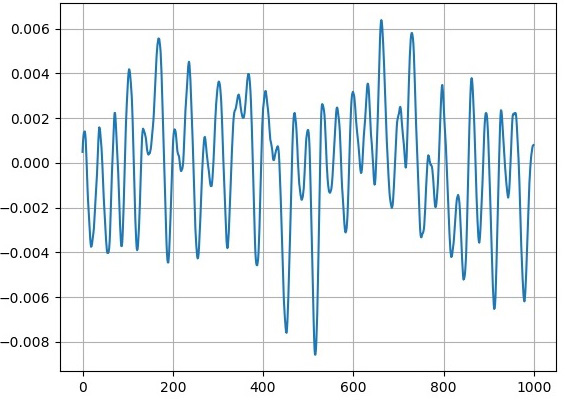
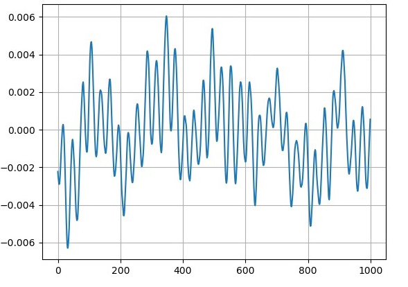
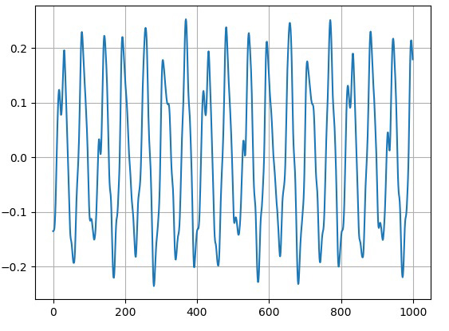
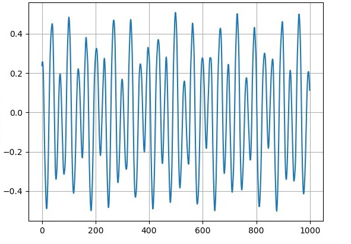
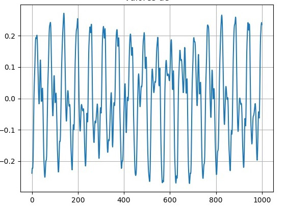
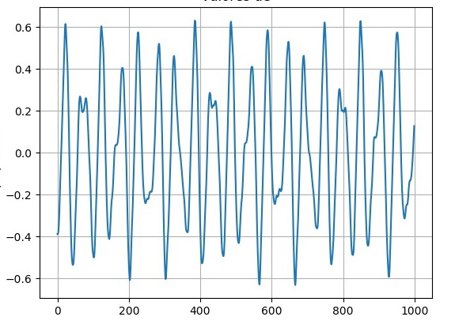

# Docs

## Descrição da geração de tons

Foi usado a tabela DTMF (Dual-Tone Multi-Frequency) abaixo:

Hz|1209 |1336|1477|1633|
|---|---|---|---|---|
697|1   |2   |3   | A  |   |
770| 4|   5|   6| B  |
852| 7  | 8  | 9  | C  |
941| *  | 0 | #  | D  |

Na tabela acima são mostradas as frequências “altas” na linha superior e as baixas na coluna mais à esquerda.
A frequência é obtida do batimento da frequência alta e baixa de uma certa tecla, por exemplo, para a tecla 5 o tom enviado é a soma de uma senóide na frequência de 1336Hz com uma outra senóide de 770Hz.
A escolha destas frequências se deve principalmente pela baixa probabilidade de se produzir estas combinações de frequências com a voz humana.

## Descrição da frequência que compõe cada tom

    não entendi o que por aqui

## Comparação de gráficos recebidos e gerados
<h1> Tom 0 </h1>

 Onda Gerada X Onda Recebida 

  
  

<h1> Tom 1 </h1>

 Onda Gerada X Onda Recebida 

  
  

<h1> Tom 2 </h1>

 Onda Gerada X Onda Recebida 

  
  

<h1> Tom 3 </h1>

 Onda Gerada X Onda Recebida 

  
  

<h1> Tom 4 </h1>

 Onda Gerada X Onda Recebida 

  
  

<h1> Tom 5 </h1>

 Onda Gerada X Onda Recebida 

  
  

<h1> Tom 6 </h1>

 Onda Gerada X Onda Recebida 

  
  

<h1> Tom 7 </h1>

 Onda Gerada X Onda Recebida 

  
  

<h1> Tom 8 </h1>

 Onda Gerada X Onda Recebida 

  
  

<h1> Tom 9 </h1>

 Onda Gerada X Onda Recebida 

  
  

<h1> Considerações em relação aos gráficos </h1>

Consideremos satisfatório as comparações finais obtidas nos gráficos. Obviamente não estavam 100% iguais, devido ao fato
que as ondas geradas pelo Encoder foram feitas a partir de funções senoidas específicas e "limpas", o que é praticamente 
impossível de detectar no decoder por causa de ruídos externos; é possível diminuir os erros através de filtros.