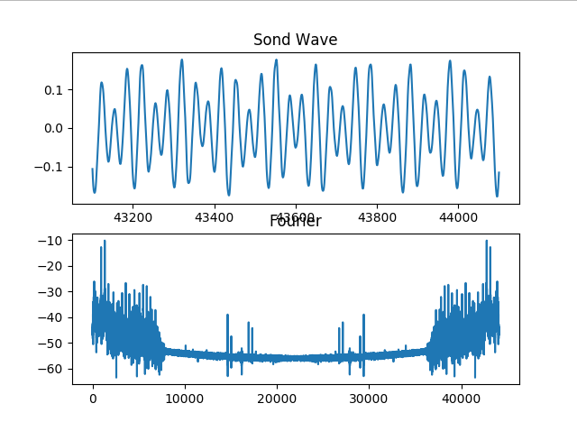
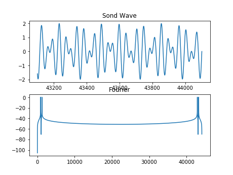

# Docs

## Comparação de gráficos recebidos e gerados
<h1> Tom 0 </h1>

 Frequências geradas (1336,941) X Frequências recebidas (1336.03,941.02) 

  
    

<h1> Tom 1 </h1>

 Frequências geradas (1209, 697) X Frequências recebidas (1209.02,697.01)  

  
    

<h1> Tom 2 </h1>

 Frequências geradas (1336,697) X Frequências recebidas (1336.03, 697.01)  

  
   

<h1> Tom 3 </h1>

 Frequências geradas (1477,697) X Frequências recebidas (1477.02, 697.01) 

  
   

<h1> Tom 4 </h1>

 Frequências geradas (1209,770) X Frequências recebidas (1209.02, 770.01) 

  
    

<h1> Tom 5 </h1>

 Frequências geradas (1336,770) X Frequências recebidas (1336.03, 770.01) 

  
    

<h1> Tom 6 </h1>

 Frequências geradas (1477,770) X Frequências recebidas (1477.02, 770.01) 

  
   

<h1> Tom 7 </h1>

 Frequências geradas (1209,852) X Frequências recebidas (1209.02, 852.02) 

  
   

<h1> Tom 8 </h1>

 Frequências geradas (1336,852) X Frequências recebidas (1336.02, 852.02) 

  
   

<h1> Tom 9 </h1>

 Frequências geradas (1477,852) X Frequências recebidas (1477.02, 852.02) 

  
  

## consideração sobre os gráficos
A diferença entre os gráficos da transformada de fourier do sinal emitido e do recebido se deve aos ruídos presente no ambiente na hora de capturar o som, entretanto, os maiores picos que simbolizam a frequência detectada são totalmente compatíveis.

<h1> Tempo utilizado </h1>

Os gráficos foram plotados com os sinais recebidos em intervalos de 1 segundo.
