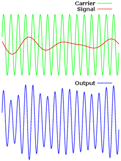
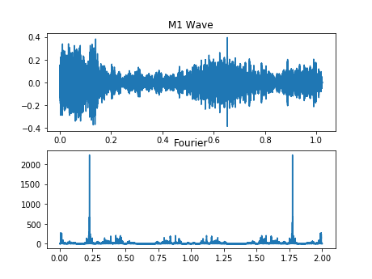
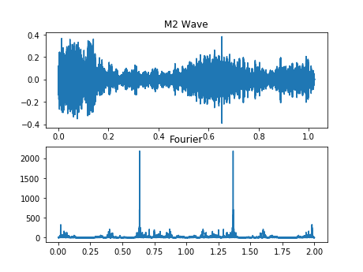
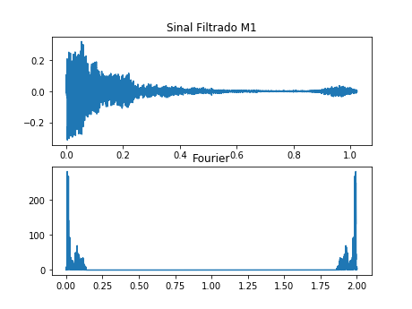
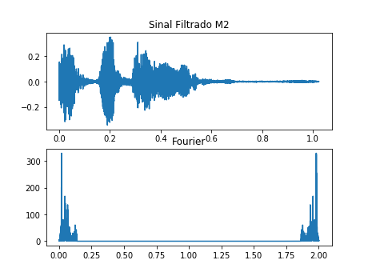
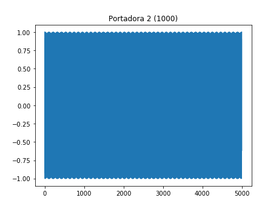

# Camada Física - Projeto 2 
#### Leonardo Medeiros e Hugo Mendes

Nessa etapa do projeto fo implementada a Modulação/DeModulação AM.

## Modulação
Modulação é o processo de variação de amplitude, de intensidade, frequência, do comprimento e/ou fase de onda numa onda de transporte , que forma uma das caracteristicas de um sinal portador (amplitude, fase ou frequencia) estes variam proporcionalmente ao sinal modulador.

A Modulação em Amplitude (AM) desenvolvida nessa etapa é a forma de modulação em que a amplitude de um sinal senoidal chamado portadora, varia em função do sinal de interesse, que é o sinal modulador. A frequencia e a fase da portadora sâo mantidas constantes.

## Demodulação
Demodulação é o processo que nos permite reverter o processo de modulação. Este metodo consiste em detectatar a onda portadora modulada e extrair dela o sinal modulante.

## Frequências das Portadoras Utilizadas
Foram utilizadas duas frequencias portadoras, com valores de 10000Hz e 20000Hz.

## Bandas Ocupadas

## Gráficos de Exibição

# Receptor

|    |    |
|    |    |

## Comparação Do Sinal Enviado e Recebido
| Sinal |             Trasmissor             |             Receptor             |
| ----- | ---------------------------------- | -------------------------------- |
| ----- |    |    |

